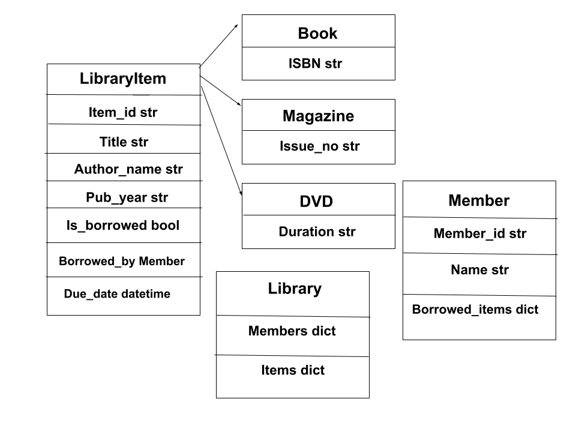

# library-management-system
A full-featured Library Management System built to streamline library operations. It enables efficient management of books, members, borrowing records, and other library activities.


# 📚 Library Management System

A Python-based **Library Management System** that demonstrates Object-Oriented Programming (OOP) principles such as encapsulation, inheritance, and polymorphism.
The project allows you to manage library items (books, magazines, DVDs), members, and borrowing activities, with automated tests written using the **unittest** framework.

---

## 🏗️ Project Structure

```
library-management-system/
│
├── library_management/
│   ├── __init__.py
│   ├── library.py          # Manages the collection of library items and members
│   ├── library_item.py     # Defines base and derived classes for items (Book, DVD, etc.)
│   └── member.py           # Handles member details and borrowing records
│
├── tests/
│   ├── test_library.py         # Unit tests for Library class
│   ├── test_library_item.py    # Unit tests for LibraryItem and its subclasses
│   └── test_member.py          # Unit tests for Member class
│
├── docs/
│   └──  class_diagram.png  # Image for the the class architect
│
├── .gitignore
└── README.md
```

---

## ⚙️ Features

* Add and manage library items (Books, Magazines, DVDs, etc.)
* Register and manage library members
* Borrow and return library items
* Calculate fines for late returns
* Ensure data consistency with object-oriented structure
* Automated testing using `unittest`

---

## 🧩 System Architecture & Class Relationships

Below is a high-level description of the relationships between the core classes:

### **1. LibraryItem (Base Class)**

* Represents a generic item in the library (e.g., title, author, publication year).
* Acts as a parent class for all item types.

### **2. Derived Classes**

* **Book**, **Magazine**, and **DVD** inherit from `LibraryItem`.
* Each subclass adds its own unique attributes, such as:

  * `Book`: ISBN
  * `Magazine`: Issue number
  * `DVD`: Duration

### **3. Member**

* Represents a library member with attributes like name and ID.
* Keeps track of items borrowed and their due dates.
* Can borrow or return items via the `Library` class.

### **4. Library**

* Acts as the system controller.
* Maintains collections of `LibraryItem` and `Member` objects.
* Handles borrowing and returning logic.
* Calculates fines using item due dates and return dates.

### **📈 Class Diagram (Text-Based Representation)**




---

## 🧪 Running the Tests

Make sure you are in the project root directory, then run:

```bash
python -m unittest discover tests
```

---

## 🧰 Requirements

* Python 3.9+
* No external dependencies required (standard library only)

---

## 🧾 License

This project is for **educational purposes** 
and demonstrates OOP and testing concepts in Python.
